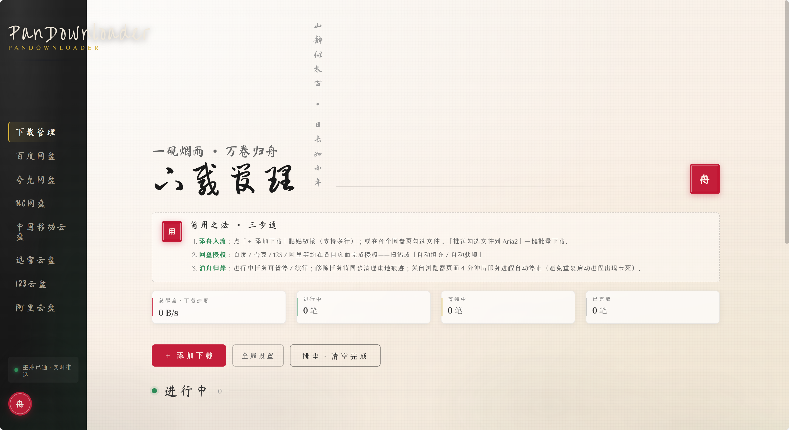

# PanDownloader

网盘文件下载工具。支持百度网盘、夸克网盘、UC 网盘、中国移动云盘、迅雷云盘、123 云盘、阿里云盘，文件一键推送到 Aria2 下载。



## 功能

| 网盘平台 | 说明 |
| :--- | :--- |
| 百度网盘 | 浏览 / 推送下载 |
| 夸克网盘 | 浏览 / 推送下载 |
| UC 网盘 | 浏览 / 推送下载 |
| 中国移动云盘 | 浏览 / 推送下载 |
| 迅雷云盘 | 浏览 / 推送下载 |
| 123 云盘 | 浏览 / 推送下载 |
| 阿里云盘 | 浏览 / 推送下载 |

- 批量勾选文件，一键推送下载
- BT / 磁力链接下载，内置 tracker 自动更新
- 下载管理：暂停 / 续行 / 做种 / 种子详情（Peer 列表、上传速度、Seeder）
- 全局设置：任务数、连接数、断点续传、下载 UA
- 代理设置与连通性测试

## 快速开始

1. 双击 `start.bat` 启动
2. 浏览器打开控制面板
3. 在网盘页完成授权，勾选文件推送下载
4. 双击 `stop.bat` 停止

## 目录结构

```
├── src/                     后端源码 (Spring Boot)
├── frontend/                前端源码 (Vue 3)
├── launcher/                Windows 启动器源码
└── docs/                    截图
```

## 构建

```
mvn clean package -DskipTests
cd frontend && npm install && npm run build
```
